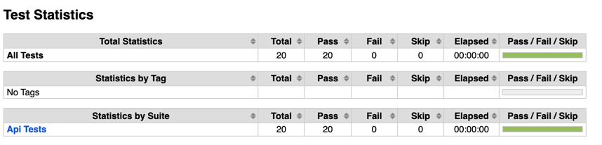

# API documentation

## SUT (system or subject under test)
Json Server repository: https://github.com/typicode/json-server
Data Model:

```
{
    "posts": [
        { "id": 1, "title": "json-server", "author": "typicode" }
    ],
    "comments": [
        { "id": 1, "body": "some comment", "postId": 1 }
    ],
    "profiles": [{"id": 1, "name": "typicode" }]
}
```

## Main Use Cases
1. As a user, I want to create new user profile
    - Method: POST 
    - Url: http://localhost:3000/profile
    - Body: 
        ```{"id": {id}, "name": "typicode" }```

2. As a user, I want to post new content
    - Method: POST 
    - Url: http://localhost:3000/post
    - Body: 
        ```{"postId": {id}, "author": "author name" }```
3. As a user, I want to comment on post of someone else
   - Method: POST 
   - Url: http://localhost:3000/comments
   - Body: 
       ```{"postId": {id}, "body": "comment content" }```
4. As a user, I want to see my post by post id
   - Method: GET
   - Url: http://localhost:3000/posts/{ID}

5. As a user, I want to see the comments on my post by post id
   - Method: GET
   - Url: http://localhost:3000/comments?postId={postID}

6. As a manager, I want to be able to search profiles by name in order to validate if they exist
   - Method: GET
   - Url: http://localhost:3000/profiles?name={username}

## Execution process
1. Install python 3.9 from https://www.python.org/downloads/
2. Install Node.js from https://nodejs.org/en/download/
3. Install json-server globally with command "npm install -g json-server"
4. In the project directory run " json-server db.json" to run json server
5. execute robot framework suite with command "robot api_tests.robot"
6. Finally test results can be referred in terminal output and log.html after execution is finished


